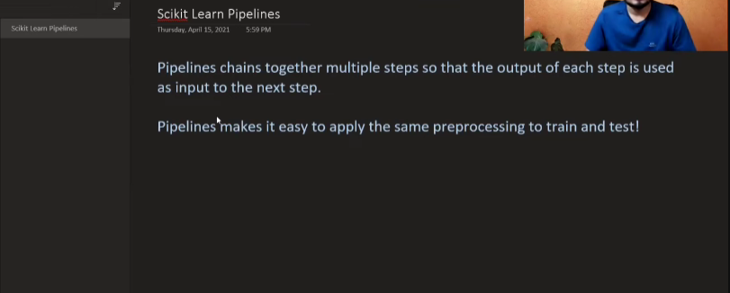

- The 2nd point in the pic means that all the preprocessing that we do in our training data, we also need to do in our test data.

- So applying same transformations twice is not a good idea

- So we can use pipelines to do that. Pipelines are a way to chain multiple steps together, so that we can apply the same transformations to both our training and test data.

- This module is divided into 2 parts:
    - we will do a small project without pipelines
    - then we will do the same project with pipelines and see the difference
